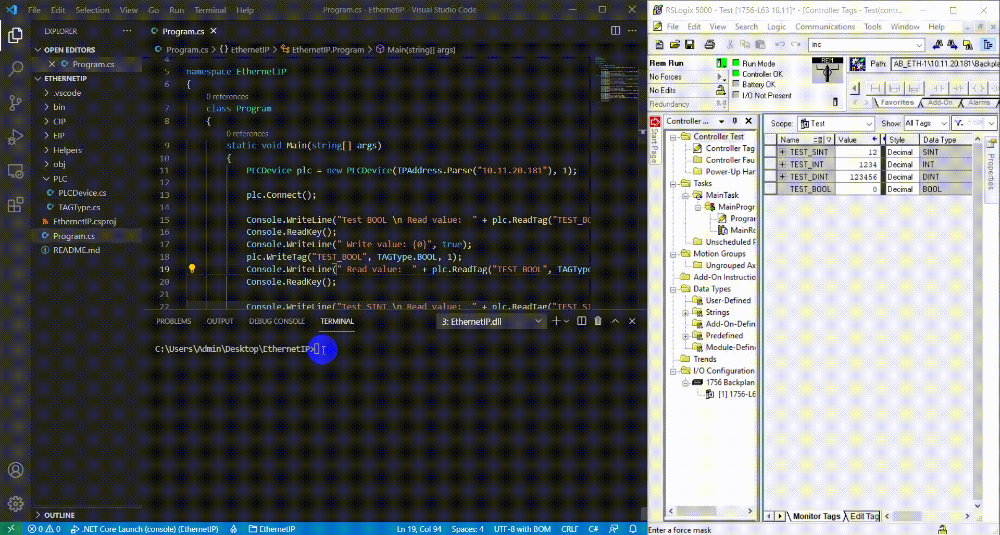

# Ethernet/IP
A simple library .NET Core 5.0 for read and write tags Rockwell Control/CompactLogix PLCs.  
## Demonstration



## Getting Started
- ### Create PLC object
```cs
PLCDevice plc = new PLCDevice(IPAddress.Parse("10.11.20.181"), 1);
```
**NOTE:**  We give the IP plc and the CPU slot.
- ### Getting Connected
```cs
plc.Connect();
```
- ### Reading Tags
**NOTE:**  Currently, we can read type tags BOOL SINT, INT and DINT.
```cs
int testBOOL = plc.ReadTag("TEST_BOOL", TAGType.BOOL);
int testSINT = plc.ReadTag("TEST_SINT", TAGType.SINT);
int testINT  = plc.ReadTag("TEST_INT", TAGType.INT);
int testDINT = plc.ReadTag("TEST_DINT", TAGType.DINT);
```
- ### Writing Tags
**NOTE:**  Currently, we can write type tags BOOL SINT, INT and DINT.
```cs
plc.WriteTag("TEST_BOOL", TAGType.BOOL, 1);
plc.WriteTag("TEST_SINT", TAGType.SINT, 23);
plc.WriteTag("TEST_INT", TAGType.INT, 110);
plc.WriteTag("TEST_DINT", TAGType.DINT, 10990);
```
- ### Disconect 
```cs
plc.Disconect();
```

## Related Projects

* [pylogix](https://github.com/dmroeder/pylogix)
